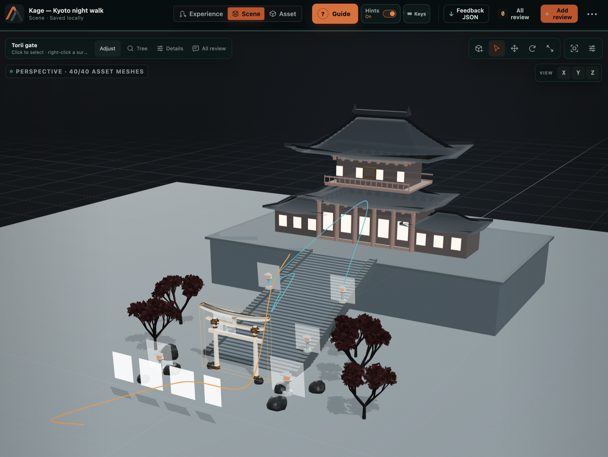
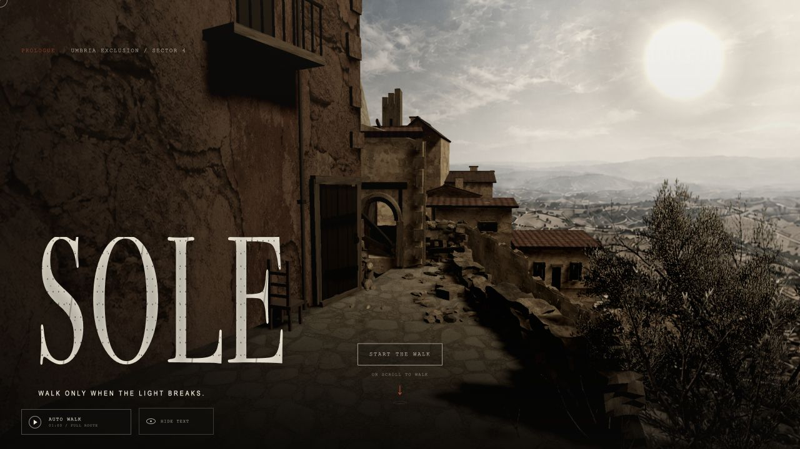
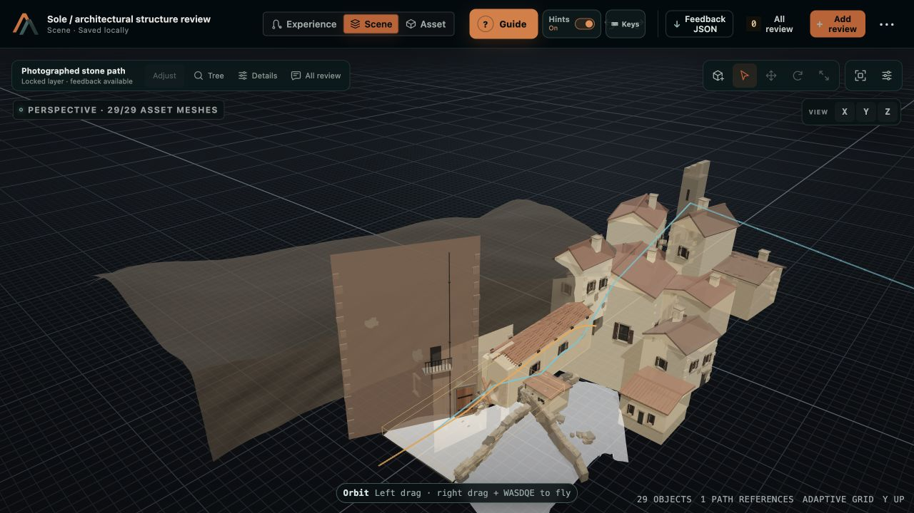
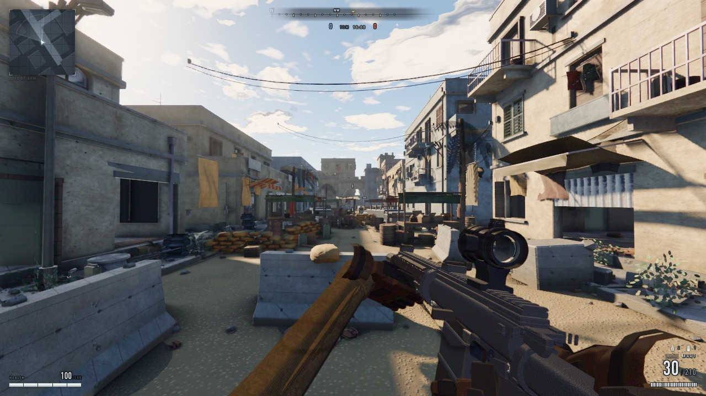
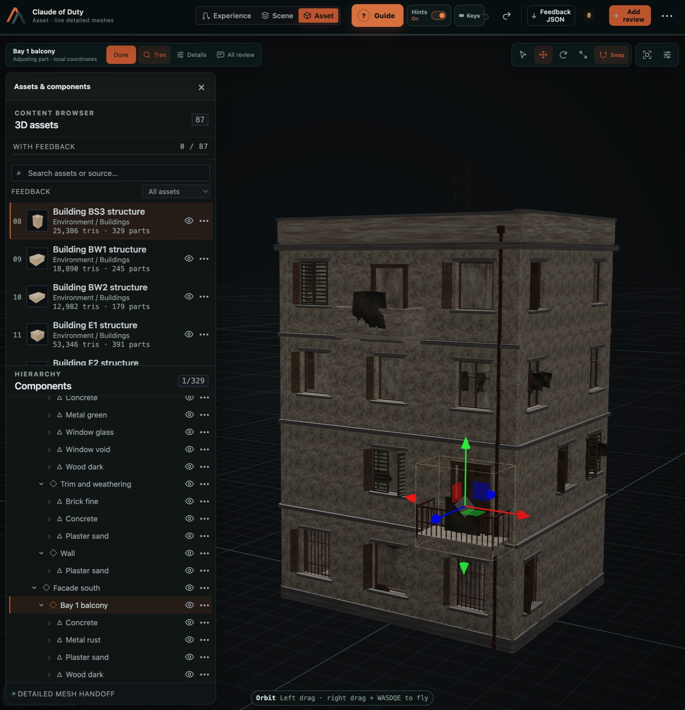
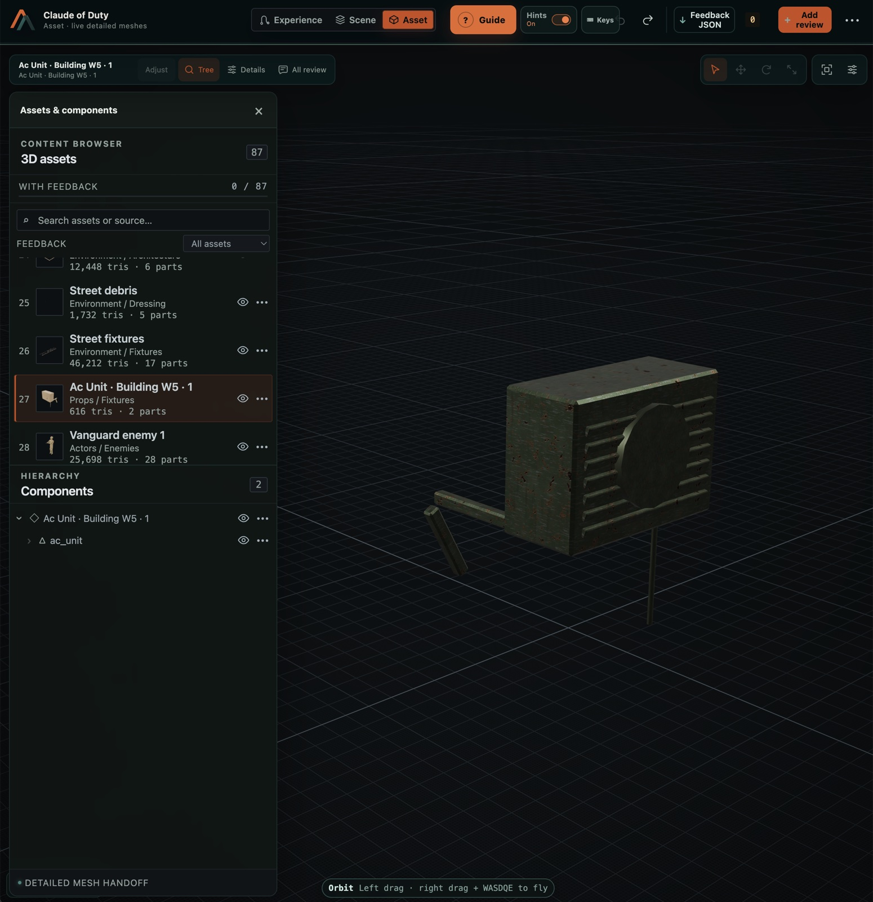
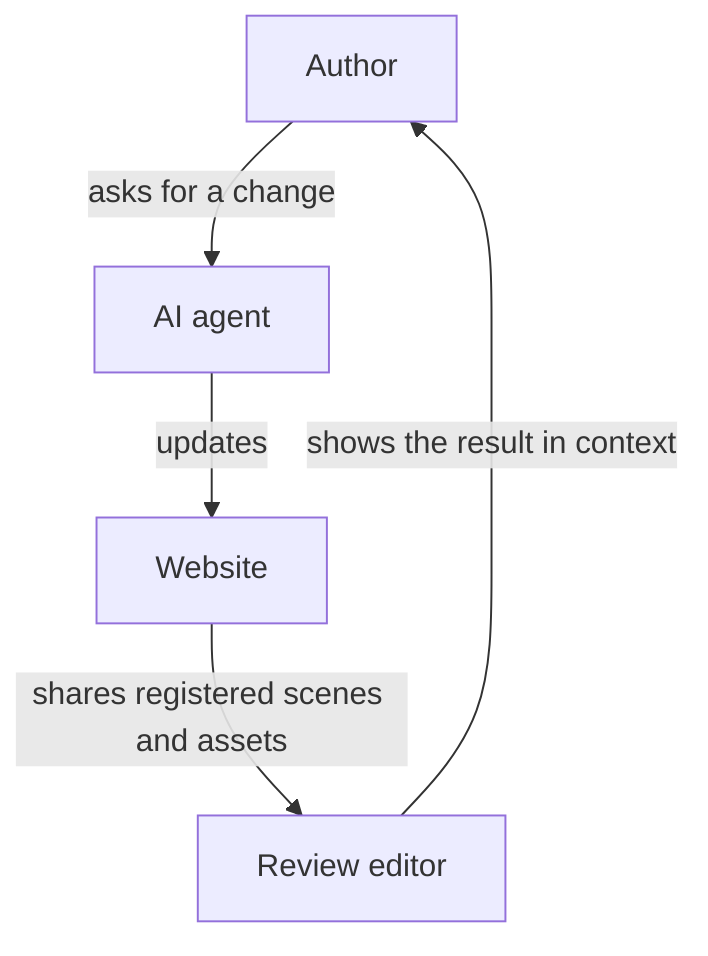

# Alterno Spatial Review

[](https://github.com/rbifulco/alterno-spatial-review/actions/workflows/ci.yml)
[](https://www.npmjs.com/package/@alterno-dev/spatial-review)
[](LICENSE)

When a 3D site needs another pass, the useful feedback is often simple: “move
this gate,” “change the material on that wall,” or “hold this view for longer.”
A coding agent still needs to know which object, asset, camera path, and source
file you mean.

Alterno Spatial Review keeps that context with the comment. Select something in
the scene, inspect how it was built, and leave feedback at the place where the
change belongs. Export the review as JSON and give it to the coding agent working
on the site.

The author and coding agent decide what to put under review. They can share one
object, one asset, a short camera move, a room, or an entire website. The
protocol carries that chosen material, and the hosted editor presents it in
scene, experience, and asset views.

[Open the hosted editor](https://spatial-review.alterno.dev/) to explore an
example. To add Spatial Review to a Three.js site, give the installation prompt
below to your coding agent.

[Install with an AI agent](#install-with-an-ai-coding-agent) ·
[See real projects](#what-you-can-review) ·
[Install manually](#quick-start) ·
[How the loop works](#from-review-to-source) ·
[Packages](#four-packages-implement-one-contract) ·
[Guides](#choose-the-guide-that-matches-the-task)

## Install with an AI coding agent

Paste this into Claude Code, Codex, Cursor, or another repository-aware coding
agent from the root of the website you want to integrate:

```text
Add Alterno Spatial Review to this Three.js website. Read and follow the complete
workflow at https://github.com/rbifulco/alterno-spatial-review/blob/main/agents/install.md.

Start by inspecting the site and recording the ordinary-page baseline. Before
installing anything or enabling a bridge, ask me to approve the editor origin
and the review data it will receive, exactly as the workflow requires. Then:
- create the integration plan;
- install the released @alterno-dev/spatial-review package;
- expose only meaningful review subjects with stable IDs and searchable source refs;
- include authored camera/navigation sequences when present;
- connect and verify every applicable editor view;
- export a sample feedback JSON and prove it maps back to source; and
- run the existing tests/build plus the workflow's browser and performance checks.

Keep the live website authoritative. Report what was exposed, what was excluded,
the validation evidence, and any remaining limitations.
```

The agent will pause for the required data-access decision before enabling the
official editor. Installation alone exposes nothing. The bridge only exposes
the scene roots, descendants, assets, source references, and texture data the
integration deliberately registers. See [exactly what is shared](#quick-start)
and the [complete installation workflow](agents/install.md).

If you prefer to do the integration yourself, jump to the
[manual quick start](#quick-start).

## What you can review

These are ordinary pages on the left and their structured editor views on the
right. The editor shows scene hierarchy, reusable assets, authored journeys,
stable identities, and source references alongside the rendered result.

Each example exports a whole website to show the range of the editor. An
integration can draw a much smaller boundary. The author and agent choose the
amount of context needed to give clear feedback for the current task.

### Kage — a scroll-led Kyoto night walk

[Open Kage](https://rbifulco.github.io/kage/) ·
[Review it](https://spatial-review.alterno.dev/?site=https%3A%2F%2Frbifulco.github.io%2Fkage%2F)

| Live page | Scene review |
| --- | --- |
|  |  |

The useful bit is not only seeing the temple: a reviewer can select the torii
gate as a stable object, inspect the whole authored composition, and review the
camera and aim paths that create the arrival.

**Project history.** The reviewed build is [Rob Bifulco's Spatial Review
integration](https://github.com/rbifulco/kage) of [Kage, the original project by
Meng To](https://github.com/MengTo/kage): a deliberately compact, single-page
Three.js design study combining procedural temple architecture with generated
scene plates and foreground artwork.

### Sole — a cinematic walk through an Umbrian village

[Open Sole](https://sole-afterlight-orvieto.robbifulco.chatgpt.site/) ·
[Review it](https://spatial-review.alterno.dev/?site=https%3A%2F%2Fsole-afterlight-orvieto.robbifulco.chatgpt.site%2F)

| Live page | Scene review |
| --- | --- |
|  |  |

Sole shows how a continuous cinematic route can remain reviewable as both an
experience and a constructed world: 29 independently selectable actors, shared
assets, explicit place ownership, and a nine-stop authored journey.

**Project history.** Sole was the proving ground for Spatial Review. It
originally housed the cinematic website, two editors, a hosted relay, and the
reusable protocol code. In August 2026 those responsibilities were split so
Sole could remain an independent example site while the protocol, SDK,
validators, and installation guidance became this public MIT-licensed project.

### Claude of Duty — a procedural browser FPS

[Open Claude of Duty](https://rbifulco.github.io/Claude-of-Duty/) ·
[Review it](https://spatial-review.alterno.dev/?site=https%3A%2F%2Frbifulco.github.io%2FClaude-of-Duty%2F)



| Building asset and component hierarchy | Prop asset in isolation |
| --- | --- |
|  |  |

Here the review representation makes a dense procedural level legible. A
reviewer can move from the market to one of 87 assets, isolate a complete
building with its 329-part hierarchy, or focus on a two-part prop—all with the
stable identity and source context an agent needs to act on the feedback.

**Project history.** The reviewed build is [Rob Bifulco's
fork](https://github.com/rbifulco/Claude-of-Duty) of [Matt Shumer's original
Claude of Duty](https://github.com/mshumer/Claude-of-Duty). The browser FPS was
built by a fleet of AI agents against a shared architecture contract: roughly
55,000 lines across 11 subsystems. Every mesh, texture, animation, and sound is
generated from code.

## Point to what you mean

When you review a spatial project, you often want to say “move this gate,”
“change the material on that wall,” or “hold this camera angle for longer.” The
words depend on what you can see and where it sits in the scene.

Spatial Review carries the chosen context with your feedback. A selected object
can keep its identity, place in the hierarchy, transform, geometry, materials,
and source reference. Camera feedback can keep the path, aim, timing, field of
view, and named stops. The author and agent agree on what the review needs, and
the agent can then find the relevant code and make the requested change.

This gives authors a direct way to describe changes inside a scene. It also
reduces the time an agent spends guessing which object or source definition a
comment refers to.

## From review to source

The author and agent choose which scenes, assets, and journeys to share. The
editor provides a workspace for that material and records feedback with the
selected object or moment. The coding agent reads the exported feedback, updates
the source, and publishes a fresh review.



1. The author asks for a change and the agent updates the website.
2. The website registers the objects and journeys available for review.
3. The discovery and capture bridges share the registered material with an
   approved editor. A discovery document can provide the same entry point to
   tools outside the browser.
4. The author reviews the scene, experience, or asset and exports feedback.
5. The agent follows the identifiers and source references back to the code.

| Review scale | What it preserves | Useful for |
| --- | --- | --- |
| **Scene review** | Places and their contents, independent placements, visibility, and alternative classification views | Explicit ownership, composition, hierarchy, and context |
| **Experience review** | Camera and aim paths, named stops, timing, and FOV | Movement, reveals, framing, and lens intent |
| **Asset review** | Component hierarchy, geometry, materials, textures, and local transforms | Shared design, construction, and material feedback |

The accepted [scene ownership contract](docs/ownership-first-scene.md) adds
explicit assemblies that carry transforms while keeping placements, shared
designs, and classification separate. It includes negotiation and migration
requirements.
The contract was accepted in [protocol issue #11](https://github.com/rbifulco/alterno-spatial-review/issues/11);
package version 0.5.0 and later contains the implementation.

> [!IMPORTANT]
> The website opts in and registers every object available for review. Spatial
> Review receives the registered objects and their supported descendants.

The protocol works across rendering engines. The current SDK includes a Three.js
adapter.

## Quick start

AI agents must use the complete
[installation and update workflow](agents/install.md). The quick start is an API
introduction. It omits required planning, lifecycle, lean browser checks, and
reporting steps.

> [!IMPORTANT]
> Installing the package alone does not expose data or start a connection.
> Calling either bridge enables its corresponding browser access.
> Both bridges trust the exact official editor origin by default:
> `https://spatial-review.alterno.dev`.
> The discovery bridge exposes discovery metadata.
> The capture bridge exposes registered roots and their supported descendants.
> This data can include descendant geometry, materials, textures, and texture
> bytes that are intended for review.
> Neither bridge automatically exposes arbitrary DOM, cookies, storage,
> unrelated application state, or objects outside registered roots.
> Registered texture URL strings are part of review data. Remove credentials,
> signed query tokens, and other secrets from those strings before bridge
> attachment.
>
> Websites may advertise an optional editor-origin compatibility policy and the
> capture bridge explicitly rejects a correlated unauthorized handshake without
> exposing scene data. The advertised policy improves preflight UX but never
> replaces runtime origin checks. See the
> [editor-origin authorization contract](docs/editor-origin-authorization.md).
>
> When the editor embeds the discovery page or capture page, that page must
> permit framing by the exact editor origin. An opener-based popup does not
> require a framing exception.

Before you call either bridge, follow
[Obtain permission](agents/install.md#1-obtain-permission).

For this quick start, select one representative subject for each editor view
that the integration exposes. Record its authoritative source, expected
appearance, and expected behavior. These records are the capture baseline.

### 1. Install the Three.js SDK

```sh
npm install @alterno-dev/spatial-review three
```

**Complete when:** the lockfile resolves the SDK and a Three.js version inside
the SDK's `peerDependencies` range. The website build passes.

### 2. Register meaningful scene objects

```ts
import {
  SceneAssetRegistry,
  attachSceneAssetRegistryBridge,
  attachSpatialReviewDiscoveryBridge,
  createSpatialReviewEditorAuthorization,
} from "@alterno-dev/spatial-review";

const authorization = createSpatialReviewEditorAuthorization({
  // Use true only after the user approves the official hosted editor.
  allowOfficialEditor: true,
  // Different loopback ports are trusted only with an explicit local-dev opt-in.
  allowLoopbackPeers: false,
  // Public discovery is opt-in and must list every finite runtime editor origin.
  advertiseEditorOriginPolicy: {
    publicOrigins: ["https://spatial-review.alterno.dev"],
  },
});

attachSpatialReviewDiscoveryBridge({
  name: "My spatial project",
  liveCapture: "/?spatial-review-capture=1",
}, authorization);

const registry = new SceneAssetRegistry("project-v1");

registry.register({
  actorId: "main-building",
  assetId: "main-building",
  name: "Main building",
  category: "Architecture",
  sourceRef: "src/scene/buildings/createMainBuilding.ts#createMainBuilding",
  root: mainBuilding,
  tags: ["building", "primary"],
});

registry.registerNavigationSequence({
  id: "arrival-journey",
  name: "Arrival journey",
  sourceRef: "src/scene/rail.ts#arrivalJourney",
  stops: [
    { id: "entry", name: "Entry", camera: [0, 1.7, 6], target: [0, 1.5, 0], fov: 50, sourceRef: "src/scene/rail.ts#entry" },
    { id: "court", name: "Courtyard", camera: [4, 1.7, 1], target: [0, 1.5, 0], fov: 44, sourceRef: "src/scene/rail.ts#court" },
  ],
  segments: [{
    id: "entry--court",
    fromStopId: "entry",
    toStopId: "court",
    weight: 1,
    camera: {
      kind: "line",
      points: [
        { id: "entry-camera", role: "stop", stopId: "entry", position: [0, 1.7, 6], sourceRef: "src/scene/rail.ts#entry" },
        { id: "court-camera", role: "stop", stopId: "court", position: [4, 1.7, 1], sourceRef: "src/scene/rail.ts#court" },
      ],
    },
    aim: { kind: "fixed-target", target: [0, 1.5, 0] },
  }],
});

attachSceneAssetRegistryBridge(registry, authorization);
```

`allowOfficialEditor` defaults to `true`, but the example spells it out so the
authorization is visible in source. Cross-origin loopback access requires
`allowLoopbackPeers: true` during local development. Additional production
editors must be exact canonical HTTPS origins in `allowedOrigins`. Runtime
origins stay private unless an immutable shared configuration explicitly lists
the complete finite set in `advertiseEditorOriginPolicy.publicOrigins`.

Navigation sequences are semantic camera journeys rather than generic splines.
They keep camera position, aim, journey stops, segment timing, lens transitions,
stable point IDs, and source references together so review tools can return
spatially anchored feedback an agent can apply to the original implementation.
See [Export navigation sequences](agents/exporting-navigation-sequences.md)
for the agent-facing extraction and presentation guide.

**Complete when:** the capture page registers each listed review subject and starts
only the bridges approved by the user.

### 3. Open the hosted editor

Open [Spatial Review](https://spatial-review.alterno.dev/) and paste the website
URL, or deep-link directly:

```ts
import { spatialReviewEditorUrl } from "@alterno-dev/spatial-review";

const reviewUrl = spatialReviewEditorUrl(window.location.href);
// https://spatial-review.alterno.dev/review?site=...
```

**Complete when:** the editor connects and shows each representative subject in
the capture baseline.

### 4. Optionally publish the discovery document

The discovery bridge above is sufficient for a client-only editor. To support
the CLI and other non-browser tools, also serve
`/.well-known/spatial-review.json`:

```json
{
  "schema": "spatial-review-discovery/v1",
  "version": 1,
  "name": "My spatial project",
  "websiteUrl": "/",
  "liveCapture": "/?spatial-review-capture=1"
}
```

**Complete when:** each advertised static URL returns a valid document. Skip
this step when the integration uses browser discovery only.

### 5. Optionally validate the deployed document

Run this command when the deployment publishes static discovery:

```sh
npx @alterno-dev/spatial-review-cli validate https://project.example
```

**Complete when:** the CLI reports no discovery, schema, or reference error.
When the deployment does not publish static discovery, skip this step and record
that validation is browser-only.

> [!TIP]
> Using an AI coding agent? Point it to the
> [installation and update workflow](agents/install.md). It covers adding the SDK
> to an existing website or refining its integration and exports against updated
> guidance, then verifying feedback in each applicable editor.

<details>
<summary><strong>Install directly from source instead of npm</strong></summary>

```sh
git clone https://github.com/rbifulco/alterno-spatial-review.git
cd alterno-spatial-review
npm ci
npm run build

cd ../my-spatial-website
npm install \
  file:../alterno-spatial-review/packages/protocol \
  file:../alterno-spatial-review/packages/sdk
```

The local packages export their compiled `dist` directories, so build the
checkout before installing it. The [source-installation guide](docs/install-from-source.md)
covers active development, vendoring, CI, and updates.

</details>

## Present scenes and assets so intent remains actionable

Structure review around placement, journey, and construction decisions. A
reviewer should be able to move one gate, adjust its arrival reveal, and comment
on its arch as distinct instructions that lead to the correct source definitions.

Before choosing or changing actor boundaries, asset hierarchy, or source mappings,
read [Structure a website for review](agents/structuring-for-review.md). For authored
camera or scroll routes, also follow
[Export navigation sequences](agents/exporting-navigation-sequences.md).

## Four packages implement one contract

| Package | Purpose |
| --- | --- |
| [`@alterno-dev/spatial-review-protocol`](https://www.npmjs.com/package/@alterno-dev/spatial-review-protocol) | Engine-neutral contracts, identifiers, types, and URL normalization |
| [`@alterno-dev/spatial-review`](https://www.npmjs.com/package/@alterno-dev/spatial-review) | Three.js registry, serializer, runtime builder, and exact-origin discovery and capture bridges |
| [`@alterno-dev/spatial-review-validator`](https://www.npmjs.com/package/@alterno-dev/spatial-review-validator) | Runtime validation for discovery, asset, and review-index documents |
| [`@alterno-dev/spatial-review-cli`](https://www.npmjs.com/package/@alterno-dev/spatial-review-cli) | Integration validation from a terminal or CI |

The packages are versioned together because they describe and implement the
same compatibility boundary. Producers, validators, and consumers need to agree
on what each contract means.

## Choose the guide that matches the task

| Goal | Guide |
| --- | --- |
| Add or refine review support on an existing website | [Install or update Spatial Review](agents/install.md) |
| Choose actor boundaries, asset hierarchy, and source mappings | [Structure a website for review](agents/structuring-for-review.md) |
| Export a camera route, scroll route, guided view, or spatial journey | [Export navigation sequences](agents/exporting-navigation-sequences.md) |
| Develop against a local checkout | [Install from source](docs/install-from-source.md) |
| Understand manifests, origins, and capture | [Website integration reference](docs/integrating-a-website.md) |
| Stream a geometry producer that exceeds its recorded budget | [Deferred asset streaming](docs/deferred-asset-streaming.md) |
| Screen ordinary-page performance | [Spatial Review performance screen](docs/performance-profile.md) |
| Evaluate or change agent guidance | [Agent guidance quality rubric](docs/governance/agent-guidance-quality.md) |
| Propose an interoperable contract change | [Protocol change process](docs/governance/protocol-changes.md) |
| Prepare and publish a release | [Maintainer release process](docs/governance/releases.md) |

## Contributing

Contributions to the protocol, SDK, validators, CLI, examples, and
documentation are welcome.

```sh
npm ci
npm test
npm run pack:check
```

Read [CONTRIBUTING.md](CONTRIBUTING.md) for the complete commit, pull-request,
testing, and Changesets workflow.

- [Ask a question or explore an idea](https://github.com/rbifulco/alterno-spatial-review/discussions)
- [Report a bug or propose a feature](https://github.com/rbifulco/alterno-spatial-review/issues)
- [Report a vulnerability privately](SECURITY.md)

## License

[MIT](LICENSE)
