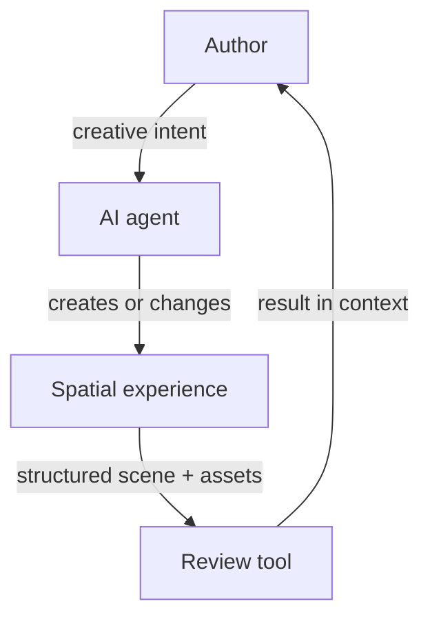

# Alterno Spatial Review

[](https://github.com/rbifulco/alterno-spatial-review/actions/workflows/ci.yml)
[](https://www.npmjs.com/package/@alterno-dev/spatial-review)
[](LICENSE)

**AI agents can realize a wide range of creative ideas, provided authors can
express their intent in a form the agent can understand and act on.**

Spatial work makes this difficult. Authors often need to refer to what they see:
this object, that material, the proportion between two elements, or the way a
space feels. The agent, however, works from scene data and code.

Alterno Spatial Review is an open protocol and TypeScript toolkit that explores
how to make this exchange more effective and efficient. The author reviews what
the agent creates and expresses the next intent in context. The agent receives
that intent connected to the objects, relationships, assets, and code it can
change.

[Quick start](#quick-start) ·
[Hosted editor](https://spatial-review.alterno.dev/) ·
[How the loop works](#a-controlled-representation-closes-the-loop) ·
[Presentation rules](#present-scenes-and-assets-so-intent-remains-actionable) ·
[Packages](#four-packages-implement-one-contract) ·
[Guides](#choose-the-guide-that-matches-the-task) ·
[Contributing](#contributing)

## Author intent needs spatial context

The author is not an external reviewer. Reviewing is one step in the creative
loop: the agent produces a result, the author evaluates it, and that evaluation
becomes the next instruction.

Text alone often loses the context behind the instruction. A screenshot can show
the problem, but it does not identify the relevant scene structure. An object ID
can identify the target, but it does not preserve the surrounding relationships
that explain the author's intent.

Stable identity therefore solves only part of the problem. Scene relationships,
hierarchy, transforms, geometry, materials, and source references preserve the
context needed to interpret what the author means and where the agent can act.

The goal is not merely to attach comments to objects. It is to make spatial
intent easier for authors to express and easier for agents to interpret.

## A controlled representation closes the loop



1. The author expresses an intent and the agent produces a result.
2. The website registers the objects that matter for evaluating that result.
3. It advertises its scenes, assets, and supported capture methods through the
   browser bridge, with an optional discovery document for non-browser tools.
4. A compatible review tool presents the result with its spatial structure.
5. The author's evaluation becomes the next instruction, connected to stable
   identifiers and source references.

This keeps the website authoritative. The review tool does not infer structure
from rendered pixels, and the agent does not need unrestricted access to the
application.

| Review scale | What it preserves | Useful for |
| --- | --- | --- |
| **Scene review** | Places and their contents, independent placements, visibility, and alternative classification views | Explicit ownership, composition, hierarchy, and context |
| **Asset review** | Component hierarchy, geometry, materials, textures, and local transforms | Shared design, construction, and material feedback |

The [ownership-first implementation draft](docs/ownership-first-scene.md) adds
explicit transform-only assemblies while keeping placements, shared designs, and
classification separate. It includes negotiation, migration, and acceptance
requirements; it is not yet an accepted or published protocol change.

> [!IMPORTANT]
> Spatial Review does not scrape an arbitrary WebGL canvas. The website opts in
> and exposes only the objects that should participate in review.

The protocol is engine-neutral. The current SDK includes a Three.js adapter;
adapters for other engines are not yet included.

## Quick start

> [!IMPORTANT]
> Installing the package alone does not expose data or start a connection.
> Calling the SDK's discovery and scene bridge functions opts the page into
> review access. By default, those bridges trust the exact official editor
> origin, `https://spatial-review.alterno.dev`. That editor can request the
> discovery metadata, registered scene/asset structures, and registered texture
> bytes intended for review; it does not receive arbitrary DOM, application
> state, credentials, or unregistered objects. Set `allowOfficialEditor: false`
> on both bridges to opt out, and use `allowedOrigins` for any additional
> self-hosted review tools.
> Live no-CORS review also requires the integrated page to permit framing by
> that exact origin, typically with `Content-Security-Policy: frame-ancestors
> 'self' https://spatial-review.alterno.dev`. Do not remove framing protections
> globally or allow arbitrary ancestors.

> [!NOTE]
> This official-origin default is introduced in version 0.3.0. It is a minor,
> not patch, release so existing `^0.2.x` installations do not silently acquire
> the new authorization. Review the permission and choose an explicit
> `allowOfficialEditor` value when upgrading.

### 1. Install the Three.js SDK

```sh
npm install @alterno-dev/spatial-review three
```

### 2. Register meaningful scene objects

```ts
import {
  SceneAssetRegistry,
  attachSceneAssetRegistryBridge,
  attachSpatialReviewDiscoveryBridge,
} from "@alterno-dev/spatial-review";

attachSpatialReviewDiscoveryBridge({
  name: "My spatial project",
  liveCapture: "/?spatial-review-capture=1",
}, {
  // Explicitly records that this site allows the official hosted editor.
  allowOfficialEditor: true,
});

const registry = new SceneAssetRegistry("project-v1");

registry.register({
  actorId: "main-building",
  assetId: "main-building",
  name: "Main building",
  category: "Architecture",
  sourceRef: "src/scene/buildings/createMainBuilding.ts#createMainBuilding",
  root: mainBuilding,
  tags: ["building", "primary"],
});

registry.registerNavigationSequence({
  id: "arrival-journey",
  name: "Arrival journey",
  sourceRef: "src/scene/rail.ts#arrivalJourney",
  stops: [
    { id: "entry", name: "Entry", camera: [0, 1.7, 6], target: [0, 1.5, 0], fov: 50 },
    { id: "court", name: "Courtyard", camera: [4, 1.7, 1], target: [0, 1.5, 0], fov: 44 },
  ],
  segments: [{
    id: "entry--court",
    fromStopId: "entry",
    toStopId: "court",
    weight: 1,
    camera: {
      kind: "line",
      points: [
        { id: "entry-camera", role: "stop", stopId: "entry", position: [0, 1.7, 6] },
        { id: "court-camera", role: "stop", stopId: "court", position: [4, 1.7, 1] },
      ],
    },
    aim: { kind: "fixed-target", target: [0, 1.5, 0] },
  }],
});

attachSceneAssetRegistryBridge(registry, {
  // Use false to deny the official editor; add self-hosted tools separately.
  allowOfficialEditor: true,
});
```

`allowOfficialEditor` defaults to `true`, but the example spells it out so the
authorization is visible in source. Loopback origins are accepted during local
development. Additional production editors must be listed explicitly in
`allowedOrigins`.

Navigation sequences are semantic camera journeys rather than generic splines.
They keep camera position, aim, journey stops, segment timing, lens transitions,
stable point IDs, and source references together so review tools can return
spatially anchored feedback an agent can apply to the original implementation.
See [Export navigation sequences](agents/exporting-navigation-sequences.md)
for the agent-facing extraction and presentation guide.

### 3. Open the hosted editor

Open [Spatial Review](https://spatial-review.alterno.dev/) and paste the website
URL, or deep-link directly:

```ts
import { spatialReviewEditorUrl } from "@alterno-dev/spatial-review";

const reviewUrl = spatialReviewEditorUrl(window.location.href);
// https://spatial-review.alterno.dev/review?site=...
```

### 4. Optionally publish the discovery document

The browser bridge above is sufficient for a client-only editor. To support the
CLI and other non-browser tools, also serve `/.well-known/spatial-review.json`:

```json
{
  "schema": "spatial-review-discovery/v1",
  "version": 1,
  "name": "My spatial project",
  "websiteUrl": "/",
  "liveCapture": "/?spatial-review-capture=1"
}
```

### 5. Optionally validate the deployed document

```sh
npx @alterno-dev/spatial-review-cli validate https://project.example
```

> [!TIP]
> Using an AI coding agent? Point it to the
> [installation and update workflow](agents/install.md). It covers adding the SDK
> to an existing website or refining its integration and exports against updated
> guidance, then verifying feedback in each applicable editor.

<details>
<summary><strong>Install directly from source instead of npm</strong></summary>

```sh
git clone https://github.com/rbifulco/alterno-spatial-review.git
cd alterno-spatial-review
npm ci
npm run build

cd ../my-spatial-website
npm install \
  file:../alterno-spatial-review/packages/protocol \
  file:../alterno-spatial-review/packages/sdk
```

The local packages export their compiled `dist` directories, so build the
checkout before installing it. The [source-installation guide](docs/install-from-source.md)
covers active development, vendoring, CI, and updates.

</details>

## Present scenes and assets so intent remains actionable

Structure review around placement, journey, and construction decisions. A
reviewer should be able to move one gate, adjust its arrival reveal, and comment
on its arch as distinct instructions that lead to the correct source definitions.

Before choosing or changing actor boundaries, asset hierarchy, or source mappings,
read [Structuring for review](agents/structuring-for-review.md). For authored
camera or scroll routes, also follow
[Export navigation sequences](agents/exporting-navigation-sequences.md).

## Four packages implement one contract

| Package | Purpose |
| --- | --- |
| [`@alterno-dev/spatial-review-protocol`](https://www.npmjs.com/package/@alterno-dev/spatial-review-protocol) | Engine-neutral contracts, identifiers, types, and URL normalization |
| [`@alterno-dev/spatial-review`](https://www.npmjs.com/package/@alterno-dev/spatial-review) | Three.js registry, serializer, runtime builder, and exact-origin browser bridge |
| [`@alterno-dev/spatial-review-validator`](https://www.npmjs.com/package/@alterno-dev/spatial-review-validator) | Runtime validation for discovery, asset, and review-index documents |
| [`@alterno-dev/spatial-review-cli`](https://www.npmjs.com/package/@alterno-dev/spatial-review-cli) | Integration validation from a terminal or CI |

The packages are versioned together because they describe and implement the
same compatibility boundary. Producers, validators, and consumers need to agree
on what each contract means.

## Choose the guide that matches the task

| Goal | Guide |
| --- | --- |
| Add or refine review support on an existing website | [Install or update Spatial Review](agents/install.md) |
| Choose actor boundaries, asset hierarchy, and source mappings | [Structuring for review](agents/structuring-for-review.md) |
| Export a camera or scroll spline for review | [Export navigation sequences](agents/exporting-navigation-sequences.md) |
| Develop against a local checkout | [Install from source](docs/install-from-source.md) |
| Understand manifests, origins, and capture | [Website integration reference](docs/integrating-a-website.md) |
| Propose an interoperable contract change | [Protocol change process](docs/governance/protocol-changes.md) |
| Prepare and publish a release | [Maintainer release process](docs/governance/releases.md) |

## Contributing

Contributions to the protocol, SDK, validators, CLI, examples, and
documentation are welcome.

```sh
npm ci
npm test
npm run pack:check
```

Read [CONTRIBUTING.md](CONTRIBUTING.md) for the complete commit, pull-request,
testing, and Changesets workflow.

- [Ask a question or explore an idea](https://github.com/rbifulco/alterno-spatial-review/discussions)
- [Report a bug or propose a feature](https://github.com/rbifulco/alterno-spatial-review/issues)
- [Report a vulnerability privately](SECURITY.md)

## License

[MIT](LICENSE)
