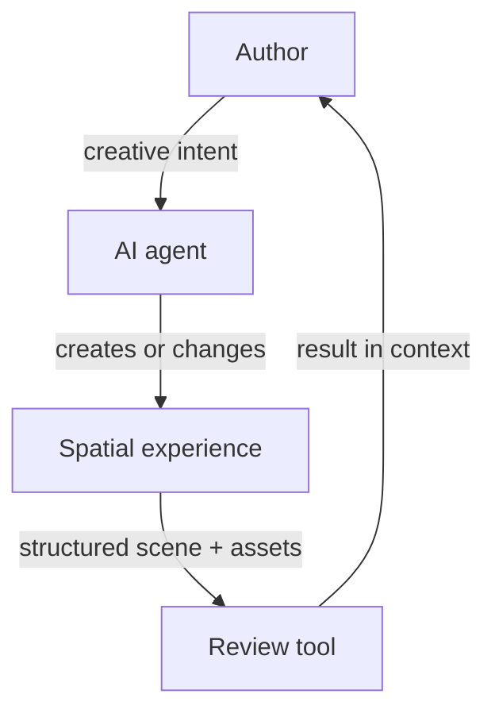

# Alterno Spatial Review

[](https://github.com/rbifulco/alterno-spatial-review/actions/workflows/ci.yml)
[](https://www.npmjs.com/package/@alterno-dev/spatial-review)
[](LICENSE)

**AI agents can realize a wide range of creative ideas, provided authors can
express their intent in a form the agent can understand and act on.**

Spatial work makes this difficult. Authors often need to refer to what they see:
this object, that material, the proportion between two elements, or the way a
space feels. The agent, however, works from scene data and code.

Alterno Spatial Review is an open protocol and TypeScript toolkit that explores
how to make this exchange more effective and efficient. The author reviews what
the agent creates and expresses the next intent in context. The agent receives
that intent connected to the objects, relationships, assets, and code it can
change.

[Quick start](#quick-start) ·
[Hosted editor](https://spatial-review.alterno.dev/) ·
[How the loop works](#a-controlled-representation-closes-the-loop) ·
[Presentation rules](#present-scenes-and-assets-so-intent-remains-actionable) ·
[Packages](#four-packages-implement-one-contract) ·
[Guides](#choose-the-guide-that-matches-the-task) ·
[Contributing](#contributing)

## Author intent needs spatial context

The author is not an external reviewer. Reviewing is one step in the creative
loop: the agent produces a result, the author evaluates it, and that evaluation
becomes the next instruction.

Text alone often loses the context behind the instruction. A screenshot can show
the problem, but it does not identify the relevant scene structure. An object ID
can identify the target, but it does not preserve the surrounding relationships
that explain the author's intent.

Stable identity therefore solves only part of the problem. Scene relationships,
hierarchy, transforms, geometry, materials, and source references preserve the
context needed to interpret what the author means and where the agent can act.

The goal is not merely to attach comments to objects. It is to make spatial
intent easier for authors to express and easier for agents to interpret.

## A controlled representation closes the loop

The review representation is not the live website and is not an authoring
surface. An agent exports the representation from authoritative source. The
editor collects evidence and proposed outcomes. The agent applies approved
changes to the website source.



1. The author expresses an intent and the agent produces a result.
2. The website registers the objects that matter for evaluating that result.
3. It advertises its scenes, assets, and supported capture methods through the
   discovery and capture bridges. It can publish a discovery document for
   non-browser tools.
4. A compatible review tool presents the result with its spatial structure.
5. The author's evaluation becomes the next instruction, connected to stable
   identifiers and source references.

This keeps the website authoritative. The review tool does not infer structure
from rendered pixels, and the agent does not need unrestricted access to the
application.

| Review scale | What it preserves | Useful for |
| --- | --- | --- |
| **Scene review** | Places and their contents, independent placements, visibility, and alternative classification views | Explicit ownership, composition, hierarchy, and context |
| **Experience review** | Camera and aim paths, named stops, timing, and FOV | Movement, reveals, framing, and lens intent |
| **Asset review** | Component hierarchy, geometry, materials, textures, and local transforms | Shared design, construction, and material feedback |

The accepted [ownership-first scene contract](docs/ownership-first-scene.md) adds
explicit transform-only assemblies while keeping placements, shared designs, and
classification separate. It includes negotiation and migration requirements.
The contract was accepted in [protocol issue #11](https://github.com/rbifulco/alterno-spatial-review/issues/11);
package version 0.5.0 and later contains the implementation.

> [!IMPORTANT]
> Spatial Review does not scrape an arbitrary WebGL canvas. The website opts in
> and exposes only the objects that should participate in review.

The protocol is engine-neutral. The current SDK includes a Three.js adapter;
adapters for other engines are not yet included.

## Quick start

AI agents must use the complete
[installation and update workflow](agents/install.md). The quick start is an API
introduction. It omits required planning, lifecycle, lean browser checks, and
reporting steps.

> [!IMPORTANT]
> Installing the package alone does not expose data or start a connection.
> Calling either bridge enables its corresponding browser access.
> Both bridges trust the exact official editor origin by default:
> `https://spatial-review.alterno.dev`.
> The discovery bridge exposes discovery metadata.
> The capture bridge exposes registered roots and their supported descendants.
> This data can include descendant geometry, materials, textures, and texture
> bytes that are intended for review.
> Neither bridge automatically exposes arbitrary DOM, cookies, storage,
> unrelated application state, or objects outside registered roots.
> Registered texture URL strings are part of review data. Remove credentials,
> signed query tokens, and other secrets from those strings before bridge
> attachment.
>
> Websites may advertise an optional editor-origin compatibility policy and the
> capture bridge explicitly rejects a correlated unauthorized handshake without
> exposing scene data. The advertised policy improves preflight UX but never
> replaces runtime origin checks. See the
> [editor-origin authorization contract](docs/editor-origin-authorization.md).
>
> When the editor embeds the discovery page or capture page, that page must
> permit framing by the exact editor origin. An opener-based popup does not
> require a framing exception.

Before you call either bridge, follow
[Obtain permission](agents/install.md#1-obtain-permission).

For this quick start, select one representative subject for each editor view
that the integration exposes. Record its authoritative source, expected
appearance, and expected behavior. These records are the capture baseline.

### 1. Install the Three.js SDK

```sh
npm install @alterno-dev/spatial-review three
```

**Complete when:** the lockfile resolves the SDK and a Three.js version inside
the SDK's `peerDependencies` range. The website build passes.

### 2. Register meaningful scene objects

```ts
import {
  SceneAssetRegistry,
  attachSceneAssetRegistryBridge,
  attachSpatialReviewDiscoveryBridge,
  createSpatialReviewEditorAuthorization,
} from "@alterno-dev/spatial-review";

const authorization = createSpatialReviewEditorAuthorization({
  // Use true only after the user approves the official hosted editor.
  allowOfficialEditor: true,
  // Different loopback ports are trusted only with an explicit local-dev opt-in.
  allowLoopbackPeers: false,
  // Public discovery is opt-in and must list every finite runtime editor origin.
  advertiseEditorOriginPolicy: {
    publicOrigins: ["https://spatial-review.alterno.dev"],
  },
});

attachSpatialReviewDiscoveryBridge({
  name: "My spatial project",
  liveCapture: "/?spatial-review-capture=1",
}, authorization);

const registry = new SceneAssetRegistry("project-v1");

registry.register({
  actorId: "main-building",
  assetId: "main-building",
  name: "Main building",
  category: "Architecture",
  sourceRef: "src/scene/buildings/createMainBuilding.ts#createMainBuilding",
  root: mainBuilding,
  tags: ["building", "primary"],
});

registry.registerNavigationSequence({
  id: "arrival-journey",
  name: "Arrival journey",
  sourceRef: "src/scene/rail.ts#arrivalJourney",
  stops: [
    { id: "entry", name: "Entry", camera: [0, 1.7, 6], target: [0, 1.5, 0], fov: 50, sourceRef: "src/scene/rail.ts#entry" },
    { id: "court", name: "Courtyard", camera: [4, 1.7, 1], target: [0, 1.5, 0], fov: 44, sourceRef: "src/scene/rail.ts#court" },
  ],
  segments: [{
    id: "entry--court",
    fromStopId: "entry",
    toStopId: "court",
    weight: 1,
    camera: {
      kind: "line",
      points: [
        { id: "entry-camera", role: "stop", stopId: "entry", position: [0, 1.7, 6], sourceRef: "src/scene/rail.ts#entry" },
        { id: "court-camera", role: "stop", stopId: "court", position: [4, 1.7, 1], sourceRef: "src/scene/rail.ts#court" },
      ],
    },
    aim: { kind: "fixed-target", target: [0, 1.5, 0] },
  }],
});

attachSceneAssetRegistryBridge(registry, authorization);
```

`allowOfficialEditor` defaults to `true`, but the example spells it out so the
authorization is visible in source. Cross-origin loopback access requires
`allowLoopbackPeers: true` during local development. Additional production
editors must be exact canonical HTTPS origins in `allowedOrigins`. Runtime
origins stay private unless an immutable shared configuration explicitly lists
the complete finite set in `advertiseEditorOriginPolicy.publicOrigins`.

Navigation sequences are semantic camera journeys rather than generic splines.
They keep camera position, aim, journey stops, segment timing, lens transitions,
stable point IDs, and source references together so review tools can return
spatially anchored feedback an agent can apply to the original implementation.
See [Export navigation sequences](agents/exporting-navigation-sequences.md)
for the agent-facing extraction and presentation guide.

**Complete when:** the capture page registers each listed review subject and starts
only the bridges approved by the user.

### 3. Open the hosted editor

Open [Spatial Review](https://spatial-review.alterno.dev/) and paste the website
URL, or deep-link directly:

```ts
import { spatialReviewEditorUrl } from "@alterno-dev/spatial-review";

const reviewUrl = spatialReviewEditorUrl(window.location.href);
// https://spatial-review.alterno.dev/review?site=...
```

**Complete when:** the editor connects and shows each representative subject in
the capture baseline.

### 4. Optionally publish the discovery document

The discovery bridge above is sufficient for a client-only editor. To support
the CLI and other non-browser tools, also serve
`/.well-known/spatial-review.json`:

```json
{
  "schema": "spatial-review-discovery/v1",
  "version": 1,
  "name": "My spatial project",
  "websiteUrl": "/",
  "liveCapture": "/?spatial-review-capture=1"
}
```

**Complete when:** each advertised static URL returns a valid document. Skip
this step when the integration uses browser discovery only.

### 5. Optionally validate the deployed document

Run this command when the deployment publishes static discovery:

```sh
npx @alterno-dev/spatial-review-cli validate https://project.example
```

**Complete when:** the CLI reports no discovery, schema, or reference error.
When the deployment does not publish static discovery, skip this step and record
that validation is browser-only.

> [!TIP]
> Using an AI coding agent? Point it to the
> [installation and update workflow](agents/install.md). It covers adding the SDK
> to an existing website or refining its integration and exports against updated
> guidance, then verifying feedback in each applicable editor.

<details>
<summary><strong>Install directly from source instead of npm</strong></summary>

```sh
git clone https://github.com/rbifulco/alterno-spatial-review.git
cd alterno-spatial-review
npm ci
npm run build

cd ../my-spatial-website
npm install \
  file:../alterno-spatial-review/packages/protocol \
  file:../alterno-spatial-review/packages/sdk
```

The local packages export their compiled `dist` directories, so build the
checkout before installing it. The [source-installation guide](docs/install-from-source.md)
covers active development, vendoring, CI, and updates.

</details>

## Present scenes and assets so intent remains actionable

Structure review around placement, journey, and construction decisions. A
reviewer should be able to move one gate, adjust its arrival reveal, and comment
on its arch as distinct instructions that lead to the correct source definitions.

Before choosing or changing actor boundaries, asset hierarchy, or source mappings,
read [Structure a website for review](agents/structuring-for-review.md). For authored
camera or scroll routes, also follow
[Export navigation sequences](agents/exporting-navigation-sequences.md).

## Four packages implement one contract

| Package | Purpose |
| --- | --- |
| [`@alterno-dev/spatial-review-protocol`](https://www.npmjs.com/package/@alterno-dev/spatial-review-protocol) | Engine-neutral contracts, identifiers, types, and URL normalization |
| [`@alterno-dev/spatial-review`](https://www.npmjs.com/package/@alterno-dev/spatial-review) | Three.js registry, serializer, runtime builder, and exact-origin discovery and capture bridges |
| [`@alterno-dev/spatial-review-validator`](https://www.npmjs.com/package/@alterno-dev/spatial-review-validator) | Runtime validation for discovery, asset, and review-index documents |
| [`@alterno-dev/spatial-review-cli`](https://www.npmjs.com/package/@alterno-dev/spatial-review-cli) | Integration validation from a terminal or CI |

The packages are versioned together because they describe and implement the
same compatibility boundary. Producers, validators, and consumers need to agree
on what each contract means.

## Choose the guide that matches the task

| Goal | Guide |
| --- | --- |
| Add or refine review support on an existing website | [Install or update Spatial Review](agents/install.md) |
| Choose actor boundaries, asset hierarchy, and source mappings | [Structure a website for review](agents/structuring-for-review.md) |
| Export a camera route, scroll route, guided view, or spatial journey | [Export navigation sequences](agents/exporting-navigation-sequences.md) |
| Develop against a local checkout | [Install from source](docs/install-from-source.md) |
| Understand manifests, origins, and capture | [Website integration reference](docs/integrating-a-website.md) |
| Stream a geometry producer that exceeds its recorded budget | [Deferred asset streaming](docs/deferred-asset-streaming.md) |
| Screen ordinary-page performance | [Spatial Review performance screen](docs/performance-profile.md) |
| Evaluate or change agent guidance | [Agent guidance quality rubric](docs/governance/agent-guidance-quality.md) |
| Propose an interoperable contract change | [Protocol change process](docs/governance/protocol-changes.md) |
| Prepare and publish a release | [Maintainer release process](docs/governance/releases.md) |

## Contributing

Contributions to the protocol, SDK, validators, CLI, examples, and
documentation are welcome.

```sh
npm ci
npm test
npm run pack:check
```

Read [CONTRIBUTING.md](CONTRIBUTING.md) for the complete commit, pull-request,
testing, and Changesets workflow.

- [Ask a question or explore an idea](https://github.com/rbifulco/alterno-spatial-review/discussions)
- [Report a bug or propose a feature](https://github.com/rbifulco/alterno-spatial-review/issues)
- [Report a vulnerability privately](SECURITY.md)

## License

[MIT](LICENSE)
