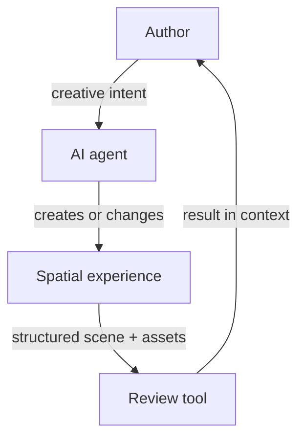

# Alterno Spatial Review

[](https://github.com/rbifulco/alterno-spatial-review/actions/workflows/ci.yml)
[](https://www.npmjs.com/package/@alterno-dev/spatial-review)
[](LICENSE)

**AI agents can realize a wide range of creative ideas, provided authors can
express their intent in a form the agent can understand and act on.**

Spatial work makes this difficult. Authors often need to refer to what they see:
this object, that material, the proportion between two elements, or the way a
space feels. The agent, however, works from scene data and code.

Alterno Spatial Review is an open protocol and TypeScript toolkit that explores
how to make this exchange more effective and efficient. The author reviews what
the agent creates and expresses the next intent in context. The agent receives
that intent connected to the objects, relationships, assets, and code it can
change.

[Quick start](#quick-start) ·
[How the loop works](#a-controlled-representation-closes-the-loop) ·
[Presentation rules](#present-scenes-and-assets-so-intent-remains-actionable) ·
[Packages](#four-packages-implement-one-contract) ·
[Guides](#choose-the-guide-that-matches-the-task) ·
[Contributing](#contributing)

## Author intent needs spatial context

The author is not an external reviewer. Reviewing is one step in the creative
loop: the agent produces a result, the author evaluates it, and that evaluation
becomes the next instruction.

Text alone often loses the context behind the instruction. A screenshot can show
the problem, but it does not identify the relevant scene structure. An object ID
can identify the target, but it does not preserve the surrounding relationships
that explain the author's intent.

Stable identity therefore solves only part of the problem. Scene relationships,
hierarchy, transforms, geometry, materials, and source references preserve the
context needed to interpret what the author means and where the agent can act.

The goal is not merely to attach comments to objects. It is to make spatial
intent easier for authors to express and easier for agents to interpret.

## A controlled representation closes the loop



1. The author expresses an intent and the agent produces a result.
2. The website registers the objects that matter for evaluating that result.
3. It advertises its scenes, assets, and supported capture methods through the
   browser bridge, with an optional discovery document for non-browser tools.
4. A compatible review tool presents the result with its spatial structure.
5. The author's evaluation becomes the next instruction, connected to stable
   identifiers and source references.

This keeps the website authoritative. The review tool does not infer structure
from rendered pixels, and the agent does not need unrestricted access to the
application.

| Review scale | What it preserves | Useful for |
| --- | --- | --- |
| **Scene review** | Placement, scale, visibility, layers, and spatial relationships | Composition, navigation, hierarchy, and context |
| **Asset review** | Component hierarchy, geometry, materials, textures, and local transforms | Shape, construction, and material feedback |

> [!IMPORTANT]
> Spatial Review does not scrape an arbitrary WebGL canvas. The website opts in
> and exposes only the objects that should participate in review.

The protocol is engine-neutral. The current SDK includes a Three.js adapter;
adapters for other engines are not yet included.

## Quick start

### 1. Install the Three.js SDK

```sh
npm install @alterno-dev/spatial-review three
```

### 2. Register meaningful scene objects

```ts
import {
  SceneAssetRegistry,
  attachSceneAssetRegistryBridge,
  attachSpatialReviewDiscoveryBridge,
} from "@alterno-dev/spatial-review";

attachSpatialReviewDiscoveryBridge({
  name: "My spatial project",
  liveCapture: "/?spatial-review-capture=1",
}, {
  allowedOrigins: ["http://localhost:3000", "https://review.example"],
});

const registry = new SceneAssetRegistry("project-v1");

registry.register({
  actorId: "main-building",
  assetId: "main-building",
  name: "Main building",
  category: "Architecture",
  sourceRef: "src/scene/buildings/createMainBuilding.ts#createMainBuilding",
  root: mainBuilding,
  tags: ["building", "primary"],
});

attachSceneAssetRegistryBridge(registry, {
  allowedOrigins: ["http://localhost:3000", "https://review.example"],
});
```

Use the local review origin while developing, then replace
`https://review.example` with the origin of the review tool you trust.

### 3. Optionally publish the discovery document

The browser bridge above is sufficient for a client-only editor. To support the
CLI and other non-browser tools, also serve `/.well-known/spatial-review.json`:

```json
{
  "schema": "spatial-review-discovery/v1",
  "version": 1,
  "name": "My spatial project",
  "websiteUrl": "/",
  "liveCapture": "/?spatial-review-capture=1"
}
```

### 4. Optionally validate the deployed document

```sh
npx @alterno-dev/spatial-review-cli validate https://project.example
```

> [!TIP]
> Using an AI coding agent? Point it to the
> [step-by-step installation guide](docs/install-with-ai.md). It includes the
> required code, validation steps, and presentation rules for useful feedback.

<details>
<summary><strong>Install directly from source instead of npm</strong></summary>

```sh
git clone https://github.com/rbifulco/alterno-spatial-review.git
cd alterno-spatial-review
npm ci
npm run build

cd ../my-spatial-website
npm install \
  file:../alterno-spatial-review/packages/protocol \
  file:../alterno-spatial-review/packages/sdk
```

The local packages export their compiled `dist` directories, so build the
checkout before installing it. The [source-installation guide](docs/install-from-source.md)
covers active development, vendoring, CI, and updates.

</details>

## Present scenes and assets so intent remains actionable

A good integration exposes design intent, not merely render data:

- Register one coherent, reviewable object per actor instead of the entire
  world as one asset.
- Give actors, assets, groups, meshes, and materials stable semantic names.
- Use one `assetId` for repeated instances of the same design and a distinct
  `actorId` for each placement.
- Keep component hierarchy and child ordering stable so component identities
  survive rebuilds.
- Set `sourceRef` to a durable code symbol or content path an agent can find.
- Preserve texture source references when available. Live integrations can
  transfer texture bytes over `postMessage`; public CORS access is optional.
- Include enough context to judge composition, but exclude helpers, debug
  meshes, secrets, and irrelevant implementation detail.

Read [Present scenes and assets for effective review](docs/install-with-ai.md#present-scenes-and-assets-for-effective-review)
for detailed patterns and examples.

## Four packages implement one contract

| Package | Purpose |
| --- | --- |
| [`@alterno-dev/spatial-review-protocol`](https://www.npmjs.com/package/@alterno-dev/spatial-review-protocol) | Engine-neutral contracts, identifiers, types, and URL normalization |
| [`@alterno-dev/spatial-review`](https://www.npmjs.com/package/@alterno-dev/spatial-review) | Three.js registry, serializer, runtime builder, and exact-origin browser bridge |
| [`@alterno-dev/spatial-review-validator`](https://www.npmjs.com/package/@alterno-dev/spatial-review-validator) | Runtime validation for discovery, asset, and review-index documents |
| [`@alterno-dev/spatial-review-cli`](https://www.npmjs.com/package/@alterno-dev/spatial-review-cli) | Integration validation from a terminal or CI |

The packages are versioned together because they describe and implement the
same compatibility boundary. Producers, validators, and consumers need to agree
on what each contract means.

## Choose the guide that matches the task

| Goal | Guide |
| --- | --- |
| Ask an AI agent to integrate a website | [Install with an AI coding agent](docs/install-with-ai.md) |
| Develop against a local checkout | [Install from source](docs/install-from-source.md) |
| Understand manifests, origins, and capture | [Website integration reference](docs/integrating-a-website.md) |
| Propose an interoperable contract change | [Protocol change process](docs/governance/protocol-changes.md) |
| Prepare and publish a release | [Maintainer release process](docs/governance/releases.md) |

## Contributing

Contributions to the protocol, SDK, validators, CLI, examples, and
documentation are welcome.

```sh
npm ci
npm test
npm run pack:check
```

Read [CONTRIBUTING.md](CONTRIBUTING.md) for the complete commit, pull-request,
testing, and Changesets workflow.

- [Ask a question or explore an idea](https://github.com/rbifulco/alterno-spatial-review/discussions)
- [Report a bug or propose a feature](https://github.com/rbifulco/alterno-spatial-review/issues)
- [Report a vulnerability privately](SECURITY.md)

## License

[MIT](LICENSE)
