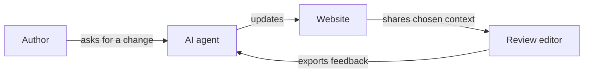

# Alterno Spatial Review

[](https://github.com/rbifulco/alterno-spatial-review/actions/workflows/ci.yml)
[](https://www.npmjs.com/package/@alterno-dev/spatial-review)
[](LICENSE)

When a 3D site needs another pass, the useful feedback is often simple: “move
this gate,” “change the material on that wall,” or “hold this view for longer.”
A coding agent still needs the object, asset, camera path, and source file behind
the comment.

Alterno Spatial Review carries that context. Select something in the scene,
inspect how it was built, leave feedback, and export the review as JSON for the
agent working on the site.

The author and agent choose the scope together. A review can contain one object,
one camera move, a room, or an entire website.

**[Open the editor](https://spatial-review.alterno.dev/)** ·
**[Install with an AI agent](#-install-with-an-ai-agent)** ·
**[Install manually](docs/installation.md)** ·
**[Browse the guides](#-guides)**

| Scene | Experience | Asset |
| --- | --- | --- |
|  |  |  |
| Select places and objects | Review camera and aim paths | Inspect parts and materials |

## ✨ What you can review

| View | Context carried with feedback | Useful for |
| --- | --- | --- |
| **Scene** | Places, objects, hierarchy, transforms, and visibility | Layout and composition |
| **Experience** | Camera and aim paths, stops, timing, and field of view | Movement, reveals, and framing |
| **Asset** | Components, geometry, materials, textures, and local transforms | Construction and shared design |

The website registers the material available to an approved editor. Registered
objects can include supported descendants, geometry, materials, textures, and
source references. The [installation guide](docs/installation.md) explains the
authorization and data boundary.

The protocol works across rendering engines. The current SDK includes a Three.js
adapter.

## 🔄 From review to source



1. The author and agent choose what to share.
2. The website registers those scenes, assets, and journeys.
3. The author reviews an object or moment in the editor.
4. The exported feedback points the agent back to the source.
5. The agent updates the site and publishes a fresh review.

## 🚀 Install with an AI agent

Paste this prompt into Claude Code, Codex, Cursor, or another coding agent from
the root of your Three.js website:

```text
Add Alterno Spatial Review to this website. Follow the complete workflow at
https://github.com/rbifulco/alterno-spatial-review/blob/main/agents/install.md.

Inspect the site first. Ask me to approve the editor origin and shared review
data before you install the package or enable a bridge. Then define the review
scope with me, add stable IDs and source references, include authored camera
journeys where useful, verify each editor view, export sample feedback, and run
the existing tests and build. Report the shared scope and validation results.
```

Installation alone shares no site data. The bridge starts after approval and
serves the material registered for review.

Developers installing by hand can follow the
[manual installation guide](docs/installation.md).

## 🖼️ Example projects

These examples share whole websites to show the range of the editor. Your
integration can use any scope that gives the author enough context.

### Kage

A night walk in five chapters through a Kyoto mountain temple.

[Open Kage](https://rbifulco.github.io/kage/) ·
[Review Kage](https://spatial-review.alterno.dev/?site=https%3A%2F%2Frbifulco.github.io%2Fkage%2F)

| Website | Scene review |
| --- | --- |
|  |  |

The editor exposes the torii gate, temple composition, and arrival paths as
separate review targets. [Rob Bifulco's integration](https://github.com/rbifulco/kage)
builds on [the original Kage project by Meng To](https://github.com/MengTo/kage),
a compact Three.js study with procedural architecture and generated artwork.

### Sole — Afterlight

A cinematic route through an abandoned hill village near Orvieto.

[Open Sole](https://sole-afterlight-orvieto.robbifulco.chatgpt.site/) ·
[Review Sole](https://spatial-review.alterno.dev/?site=https%3A%2F%2Fsole-afterlight-orvieto.robbifulco.chatgpt.site%2F)

| Website | Scene and path review |
| --- | --- |
|  |  |

Sole shares 29 actors, 29 assets, three place owners, and a journey with nine
stops. The project first housed the website, editor, relay, and protocol code.
Those parts became separate projects in August 2026, with Sole serving as an
independent integration.

### Claude of Duty

A browser FPS whose meshes, textures, animation, and sound are generated from
code.

[Open Claude of Duty](https://rbifulco.github.io/Claude-of-Duty/) ·
[Review Claude of Duty](https://spatial-review.alterno.dev/?site=https%3A%2F%2Frbifulco.github.io%2FClaude-of-Duty%2F)


| Building hierarchy | Prop in isolation |
| --- | --- |
|  |  |

The editor can open 87 assets, from a building with 329 parts to a small prop.
[Rob Bifulco's reviewed fork](https://github.com/rbifulco/Claude-of-Duty) comes
from [Matt Shumer's original project](https://github.com/mshumer/Claude-of-Duty),
which was written by a fleet of AI agents across 11 subsystems and about 55,000
lines of code.

## 📦 Packages

| Package | Purpose |
| --- | --- |
| [`@alterno-dev/spatial-review-protocol`](https://www.npmjs.com/package/@alterno-dev/spatial-review-protocol) | Types, identifiers, contracts, and URL normalization |
| [`@alterno-dev/spatial-review`](https://www.npmjs.com/package/@alterno-dev/spatial-review) | Three.js registry, serializer, runtime, and browser bridges |
| [`@alterno-dev/spatial-review-validator`](https://www.npmjs.com/package/@alterno-dev/spatial-review-validator) | Validation for discovery, scene, and asset documents |
| [`@alterno-dev/spatial-review-cli`](https://www.npmjs.com/package/@alterno-dev/spatial-review-cli) | Validation from a terminal or CI |

The packages share a version because they implement the same protocol.

## 📚 Guides

| Goal | Guide |
| --- | --- |
| Install by hand | [Manual installation](docs/installation.md) |
| Install or update with an agent | [Agent workflow](agents/install.md) |
| Choose review boundaries and source mappings | [Structure for review](agents/structuring-for-review.md) |
| Export camera and scroll routes | [Navigation sequences](agents/exporting-navigation-sequences.md) |
| Develop against a local checkout | [Install from source](docs/install-from-source.md) |
| Configure discovery, capture, and origins | [Website integration](docs/integrating-a-website.md) |
| Stream expensive geometry | [Deferred asset streaming](docs/deferred-asset-streaming.md) |
| Check page performance | [Performance profile](docs/performance-profile.md) |
| Propose a protocol change | [Protocol changes](docs/governance/protocol-changes.md) |

The [scene ownership contract](docs/ownership-first-scene.md) documents
assemblies, placements, shared designs, and migration rules.

## 🤝 Contributing

Contributions to the protocol, SDK, validators, CLI, examples, and documentation
are welcome.

```sh
npm ci
npm test
npm run pack:check
```

Read [CONTRIBUTING.md](CONTRIBUTING.md),
[start a discussion](https://github.com/rbifulco/alterno-spatial-review/discussions),
or [open an issue](https://github.com/rbifulco/alterno-spatial-review/issues).
Report security problems through [the private process](SECURITY.md).

## License

[MIT](LICENSE)
